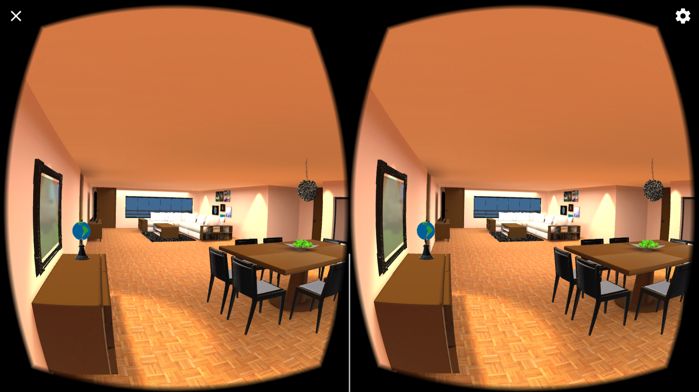
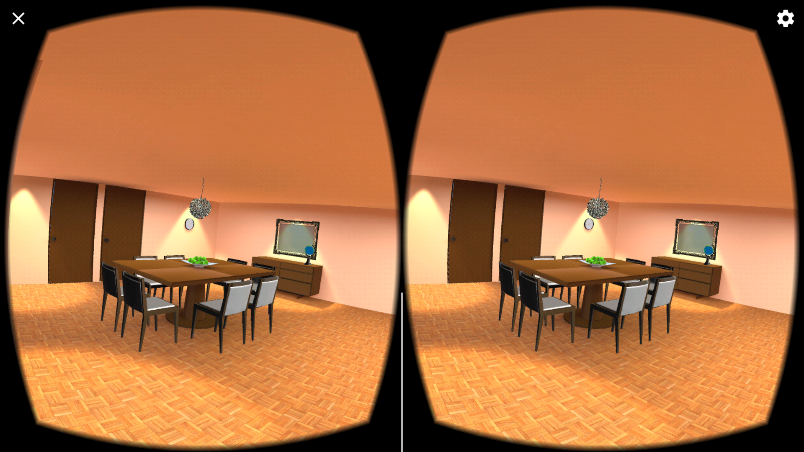
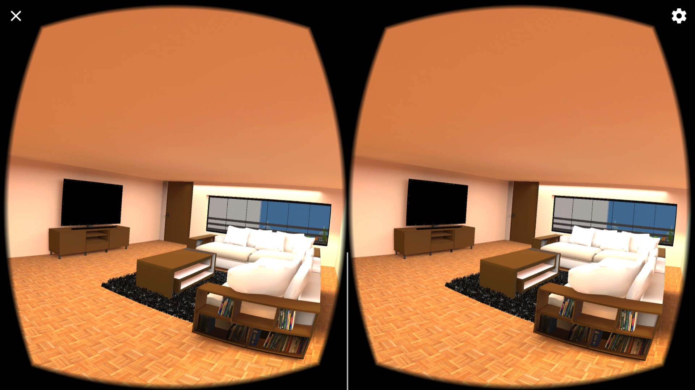

# Description
This is a VR environment created to be experienced in android and ios devices. This project is created with the help of Google VR SDK.

## Main Features
* Movement by changing angle of looking
* Made from begining rather than using given data
* Globe rotating on every touch

## Screenshots

## Steps to run project
1. Import Google VR SDK
2. Clone the repository in working directory
3. Open VRND_Course_2.unity from Scene folder
4. Build lighting by selecting Lighting menu from Menu bar

## Downloads
* Google VR SDK - [ver 1.0](https://github.com/googlevr/gvr-unity-sdk/releases/tag/v1.0.0)
* You can download the apk from [here](https://github.com/manjogsingh/VR-Apartment/releases/tag/v1.0.0)

## Author
** Manjog Singh **
* Testing Device - Oneplus 3 (Android Nougat 7.1.1)
* Time taken - 4-5 days
* Challenging task - To add movement in project and lighting
* Best part - The feeling of standing in a virtual environment made from scratch
